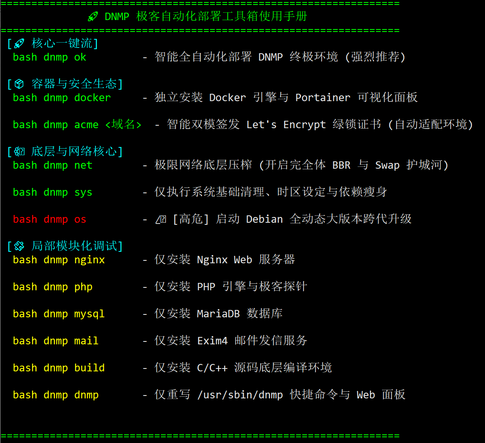

# 🆘 全局帮助与运维

### <span style="color: #1e90ff;">✒️帮助</span>
命令：
```bash
# bash dnmp h
```
列出所有可用的命令清单、日常运维指令（如 `dnmp reload` 平滑重载）、以及常见的看日志和排障方法。

输出以下帮助信息：
```bash
=================================================================
              🚀 DNMP 极客自动化部署工具箱使用手册
=================================================================
 [🚀 核心一键流]
  bash dnmp ok         - 智能全自动化部署 DNMP 终极环境 (强烈推荐)

 [📦 容器与安全生态]
  bash dnmp docker     - 独立安装 Docker 引擎与 Portainer 可视化面板

  bash dnmp acme <域名>  - 智能双模签发 Let's Encrypt 绿锁证书 (自动适配环境)

 [⚙️ 底层与网络核心]
  bash dnmp net        - 极限网络底层压榨 (开启完全体 BBR 与 Swap 护城河)

  bash dnmp sys        - 仅执行系统基础清理、时区设定与依赖瘦身

  bash dnmp os         - ⚠️ [高危] 启动 Debian 全动态大版本跨代升级

 [🧩 局部模块化调试]
  bash dnmp nginx      - 仅安装 Nginx Web 服务器

  bash dnmp php        - 仅安装 PHP 引擎与极客探针

  bash dnmp mysql      - 仅安装 MariaDB 数据库

  bash dnmp mail       - 仅安装 Exim4 邮件发信服务

  bash dnmp build      - 仅安装 C/C++ 源码底层编译环境

  bash dnmp dnmp       - 仅重写 /usr/sbin/dnmp 快捷命令与 Web 面板


=================================================================
```


***

**本脚本使用命令大全：**  
`dnmp start`    : 启动nginx、php、mariadDB  
`dnmp restart`  : 重启nginx、php、mariadDB  
`dnmp stop`     : 停止nginx、php、mariadDB  
`dnmp reload`   : 重载nginx、php、mariadDB  
`php -v` : 查看php版本号  
`systemctl (restart|start|stop|reload) nginx` : 单独重启、启动、停止、重载nginx  
`systemctl (restart|start|stop|reload) php8.x` : 单独重启、启动、停止、重载php  
`systemctl (restart|start|stop|reload) mysql` : 单独重启、启动、停止、重载mysal  