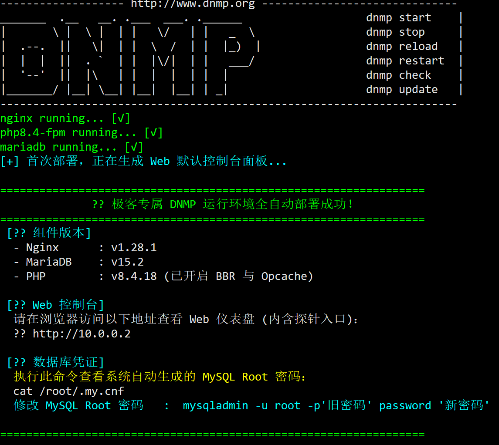
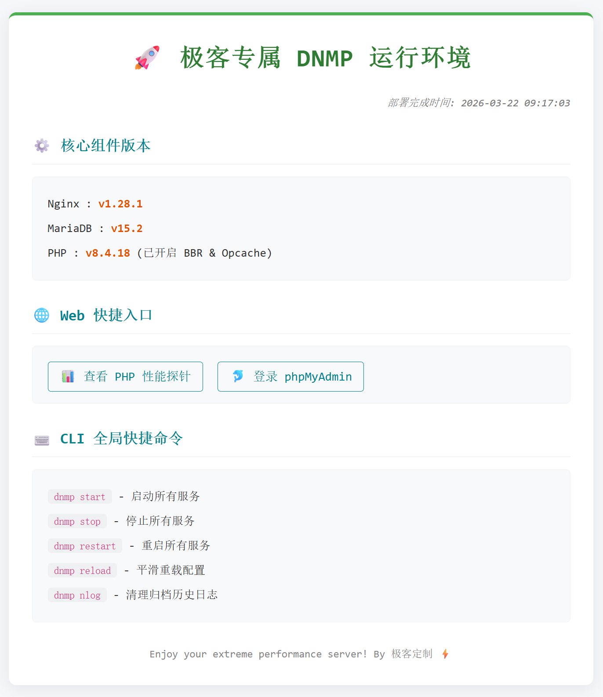

# 🛠️ 极客 DNMP 一键环境部署指南

> **⚠️ 预警**：  
> 本底层架构经过极度深度的系统级调优，**仅限运行在纯净版的 Debian 系统上**。请**绝不要**在 CentOS、Ubuntu 或已安装宝塔面板的杂交环境中执行，否则后果自负！

### <span style="color: #1e90ff;">✒️安装WEB服务器环境</span>
通过`SSH`登录服务器，使用`root`用户输入命令：
```bash
(curl -sSLO https://dnmp.beg.im/scripts/dnmp || wget -qO dnmp https://dnmp.beg.im/scripts/dnmp) && bash dnmp ok
```
一键安装最新的nginx、mariaDB、PHP等WEB服务器必须的组件，安装过程中，会自动探测系统源的地理位置，自动选取最近的源。

出现以下界面，即为成功安装完成。  
```
------------------- https://dnmp.beg.im ------------------------------
_______  .__   __. .___  ___. .______                   dnmp start    |
|       \ |  \ |  | |   \/   | |   _  \                 dnmp stop     |
|  .--.  ||   \|  | |  \  /  | |  |_)  |                dnmp reload   |
|  |  |  ||  . `  | |  |\/|  | |   ___/                 dnmp restart  |
|  '--'  ||  |\   | |  |  |  | |  |                     dnmp check    |
|_______/ |__| \__| |__|  |__| | _|                     dnmp update   |
----------------------------------------------------------------------
nginx running... [√]
php8.4-fpm running... [√]
mariadb running... [√]
[+] 首次部署，正在生成 Web 默认控制台面板...

=================================================================
              ?? 极客专属 DNMP 运行环境全自动部署成功！
=================================================================
 [?? 组件版本]
  - Nginx      : v1.28.1
  - MariaDB    : v15.2
  - PHP        : v8.4.18 (已开启 BBR 与 Opcache)

 [?? Web 控制台]
  请在浏览器访问以下地址查看 Web 仪表盘 (内含探针入口)：
  ?? http://10.0.0.2

 [?? 数据库凭证]
  执行此命令查看系统自动生成的 MySQL Root 密码：
  cat /root/.my.cnf
  修改 MySQL Root 密码   :  mysqladmin -u root -p'旧密码' password '新密码'

=================================================================
```


***
<span style="color: #e70606;">**♦️安装完成后必看指南**</span>


**🌐WEB默认探针页**  
* 安装完成后，在浏览器访问`http://你的IP`即可打开默认 Web 导航页。页面内已集成 PHP 探针、phpMyAdmin 入口，以及各组件的底层版本信息。  


**🛡️SSH 端口重置与登录**  
* 为抵御暴力破解，脚本已将默认的`SSH`登录端口由`22`强行修改为`8066`。下次登录时必须附加端口参数： 
```
ssh -p 8066 root@你的IP
```

**🔑MariaDB数据库密码查看与修改** 
* 脚本在安装时，已自动生成超强随机的 MariaDB 数据库密码（用户名为 root），并安全写入了系统的隐秘配置文件。查看初始密码请执行：
```bash
cat /root/.my.cnf
```
* 如何安全修改密码？

得益于`.my.cnf`的免密机制，你可以直接在 SSH 中用 root 登入，执行以下命令无痕修改新密码（此操作不会将密码暴露在 Linux 历史记录中）：
```bash
mysql -e "ALTER USER 'root'@'localhost' IDENTIFIED BY '这里替换成你的新密码'; FLUSH PRIVILEGES;"
```

<span style="color: #e70606;">**♦️ 核心资产与运维罗盘**</span>

当web环境安装结束，系统的控制权将正式交还给你。要彻底玩转这台满血的 Web 引擎，你必须对以下底层目录与运维生命线了如指掌：

**🌐 网站源码与权限**
* **默认 Web 根目录**：`/var/www/html` (或者 `/var/www/default`，用于存放探针和默认导航页)。
* **虚拟主机目录**：`/var/www/你的域名/` (例如申请证书后的 `/var/www/aa.bb.com`)。
* **⚠️ 目录权限设置（极其重要）**：当你用 SFTP 将网站源码（如 WordPress）上传到目录后，务必执行以下命令重置权限。否则会导致 Web 引擎无权读取文件、无法上传图片：  
```bash 
chown -R www-data:www-data /var/www/aa.bb.com
```

**⚙️ Nginx 配置**
* 站点配置目录：`/etc/nginx/sites-enabled/` (你所有域名的独立`Nginx`配置文件均落位于此)。
* `Nginx`全局配置：`/etc/nginx/nginx.conf` (用于调整底层并发连接数、Gzip 压缩等)。
* 平滑重载命令：每次修改 `Nginx` 配置后，先测试语法再平滑重载，拒绝暴力重启导致服务中断：
```bash
nginx -t 
nginx -s reload
```

**💾 MariaDB数据库与 PHP 引擎** 
* MariaDB 物理数据存储区：`/var/lib/mysql/` (整机迁移或深度备份时，这是最核心的资产)。

* PHP 核心配置 (php.ini)：位于 `/etc/php/8.x/fpm/php.ini`（8.x 代表具体版本号）。需要修改“最大上传文件限制 `(upload_max_filesize)`”或“脚本执行超时时间”时，请修改此文件，并重启 `PHP-FPM` 服务。

**📝 极客的眼睛：系统日志记录 (Logs)**  

当网站遭遇 502 Bad Gateway 或 500 Internal Server Error 时，停止盲目猜测，直接去底层查阅错误日志，真相全在这里：

* Nginx 全局错误日志：`/var/log/nginx/error.log`

* Nginx 访问日志：`/var/log/nginx/access.log`

***
#### 📦本命令会安装的应用：
* 安装最新版本的`Nginx`
* 安装最新版本的`PHP`
* 安装最新版本的`mariaDB`
* 安装最新的插件
* 安装最新的`phpmyadmin`

#### ⚙️ 本命令会进行的底层重铸：
* 将系统源替换为当前物理位置最近、最快的源
* 深度移除、清理不必要的系统冗余组件
* 安装构建环境必须的编译软件链
* 强制校准系统时区为东八区`(Asia/Shanghai)`
* 强行开启bbr网络加速以及进行内存优化
* 植入`PHP/Nginx`专用的 `Sury` 官方认证镜像源
* 修改 SSH 安全防御端口为 8066